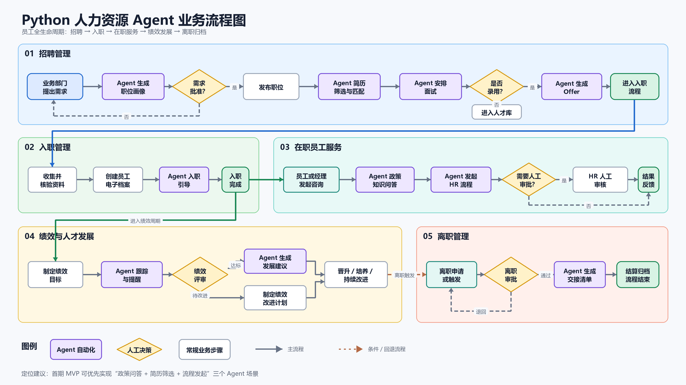

# Python 人力资源 Agent 平台

这是根据员工全生命周期业务流程图实现的可运行 MVP。项目使用 Vue 3 + TypeScript 提供可视化管理后台，FastAPI 暴露 REST API，SQLite 保存业务数据，并由 LangChain 统一编排招聘、入职、员工服务、绩效发展和离职 Agent。



## 已实现能力

| 业务阶段 | Agent 能力 | 人工控制点 |
| --- | --- | --- |
| 招聘 | 生成职位画像、AI 简历匹配、按职位选出前五名、定时发送面试邮件和短信 | 用人需求审批、完成筛选、最终录用 |
| 入职 | 生成入职任务与引导清单 | 资料核验 |
| 在职服务 | 政策问答、HR 流程识别与路由 | 低置信度问答、流程审批 |
| 绩效发展 | 跟踪结果、生成发展或改进建议 | 绩效评审 |
| 离职 | 生成交接清单 | 离职审批、最终结算 |

默认 Agent 使用确定性规则，不需要 API Key，便于本地演示、测试和后续替换为大模型实现。

## LangChain 架构

- 所有业务接口统一经过 `LangChainRuntime` 的 LCEL 调用链，并携带运行名称、标签和人工审批策略元数据。
- 七类 HR 能力注册为带类型定义的 LangChain Tools。
- 未配置模型时使用确定性 LCEL 路由，无需 API Key。
- 支持阿里云百炼和 OpenAI 两类 Provider；检测到 `DASHSCOPE_API_KEY` 时默认启用百炼 `qwen-flash`，检测到 `OPENAI_API_KEY` 时默认启用 OpenAI `gpt-5-mini`。
- 百炼通过 OpenAI 兼容协议接入 `ChatOpenAI`，默认使用华北2（北京）地址 `https://dashscope.aliyuncs.com/compatible-mode/v1`。
- 可通过 `HR_LLM_PROVIDER`、`HR_LANGCHAIN_MODEL` 和 `HR_LANGCHAIN_BASE_URL` 覆盖 Provider 配置。
- 录用、绩效定级、调岗、薪酬和离职审批仍保留人工决策。

检查运行状态：

```text
GET /api/v1/langchain/status
```

启用 Supervisor 后可调用：

```text
POST /api/v1/langchain/chat
```

安全配置真实百炼 API Key（输入内容不会显示，也不会写入仓库）：

```powershell
.\scripts\set_bailian_key.ps1
```

也可以双击 `scripts/配置百炼Key.cmd`。脚本会为当前 Windows 用户保存：

- `DASHSCOPE_API_KEY`
- `HR_LLM_PROVIDER=bailian`
- `HR_LANGCHAIN_MODEL=qwen-flash`
- `HR_LANGCHAIN_BASE_URL=https://dashscope.aliyuncs.com/compatible-mode/v1`

配置后需要重启服务。真实 Key 不得写入 `.env.example` 或提交到版本库。

## 面试通知自动化

候选人简历录入后先由 AI 计算匹配度，状态显示为“AI已评分”。HR 在职位卡点击“完成筛选，选出前五”后，系统会：

1. 按该职位匹配度从高到低选出最多五人；
2. 将入选人员标记为“进入面试”，并在招聘管理页向 HR 展示名单；
3. 为每人创建一封邮件和一条短信通知，默认在完成筛选后 24 小时发送，保证处于两天时限内；
4. 后台任务每 30 秒检查到期通知，服务重启后也会继续处理逾期任务。

邮件使用 SMTP，短信通过可配置的 HTTP Webhook 网关发送。请把以下真实配置保存到系统环境变量，而不是 `.env.example`：

```text
HR_SMTP_HOST
HR_SMTP_PORT
HR_SMTP_USERNAME
HR_SMTP_PASSWORD
HR_SMTP_FROM
HR_SMTP_USE_TLS
HR_SMS_WEBHOOK_URL
```

短信 Webhook 接收 `phone`、`message`、`candidate_id`、`job_id` 四个 JSON 字段。未配置通道时，通知会保留为“等待配置通知通道”，不会被错误标记为已发送；配置并重启服务后，到期任务会自动发送。

如需切换到 OpenAI 官方服务，可运行：

```powershell
.\scripts\set_openai_key.ps1
```

## 本地启动

```powershell
python -m venv .venv
.\.venv\Scripts\Activate.ps1
python -m pip install -e ".[dev]"
uvicorn hr_agent.main:app --reload
```

启动后访问：

- 可视化后台：http://127.0.0.1:8000
- Swagger 文档：http://127.0.0.1:8000/docs
- 健康检查：http://127.0.0.1:8000/health
- Agent 清单：http://127.0.0.1:8000/api/v1/agents

首次打开页面会进入管理员初始化。设置首位管理员后，所有业务 API 都要求 JWT 登录。支持四类角色：

| 角色 | 权限 |
| --- | --- |
| 管理员 | 全部业务、账号管理、审计日志、手动通知调度 |
| HR | 招聘、员工、咨询、绩效、离职管理 |
| 招聘人员 | 招聘职位、候选人、筛选和录用流程 |
| 只读人员 | 仅查看业务数据 |

连续五次登录失败会锁定账号 15 分钟。访问令牌默认 60 分钟过期，管理员可以在“系统管理”中创建、启用或停用账号。

## 生产部署

生产栈由 Docker Compose 统一编排：

- PostgreSQL 17：业务数据持久化；
- Redis 7（AOF）：Celery 消息代理和结果后端；
- Celery worker + beat：可靠通知任务、定时补偿和指数退避；
- Caddy：自动申请/续期 HTTPS 证书并反向代理；
- FastAPI：JWT 权限、安全响应头、审计日志和就绪检查。

部署步骤：

```powershell
Copy-Item .env.production.example .env.production
# 编辑 .env.production，填入域名及全部真实密钥
docker compose --env-file .env.production up -d --build
```

域名 DNS 必须指向服务器，并开放 80、443 端口。生产启动时会自动执行：

```text
alembic upgrade head
```

生产环境会校验 JWT 密钥、Fernet 数据加密密钥、PostgreSQL 和 Celery Broker，配置缺失时拒绝启动。Swagger 默认关闭。

### 个人数据保护

候选人和员工姓名、邮箱、手机号、简历正文、筛选画像、HR 请求、绩效反馈、离职原因，以及面试通知收件人和正文使用 Fernet 应用层加密；用于去重查询的邮箱仅保存 HMAC 摘要。写操作审计不保存请求正文，避免把简历、密码等内容复制到日志。

首次为已有数据库配置加密密钥后，执行一次：

```powershell
python scripts/reencrypt_pii.py
```

必须备份并安全托管 `HR_DATA_ENCRYPTION_KEY`；密钥丢失后加密数据无法恢复。

### PostgreSQL 备份与恢复

创建自定义格式备份：

```powershell
.\scripts\backup_postgres.ps1
```

恢复操作会覆盖当前数据库，脚本要求显式确认：

```powershell
.\scripts\restore_postgres.ps1 -BackupFile .\backups\hr_agent_YYYYMMDD_HHMMSS.dump -ConfirmRestore
```

建议通过系统计划任务每天执行备份，并将备份复制到加密的异地存储；必须定期演练恢复。

## 快速体验

`examples/requests.http` 提供一组从招聘到离职的完整请求，可在支持 HTTP Client 的编辑器中逐条运行。

也可以先执行测试：

```powershell
pytest
```

## 前端开发

前端位于 `frontend/`，使用 Vue 3 单文件组件、Composition API、TypeScript 和 Vite：

```powershell
cd frontend
pnpm install
pnpm run dev
```

开发服务器默认运行在 `http://127.0.0.1:5173`，并将 `/api` 代理到 FastAPI。生成由后端直接托管的生产资源：

```powershell
pnpm run build
```

## 目录结构

```text
src/hr_agent/
├── agents.py       # Agent 实现与统一注册表
├── api.py          # 员工全生命周期 API
├── config.py       # 环境变量配置
├── database.py     # SQLite / SQLAlchemy 会话
├── langchain_runtime.py # LCEL、Tools 与 Supervisor
├── main.py         # FastAPI 应用入口
├── models.py       # 业务数据模型
└── schemas.py      # API 请求响应模型
frontend/
├── src/App.vue     # 可视化管理后台
├── src/api.ts      # 前端 API 客户端
└── dist/           # 生产构建产物
```

## 接入真实大模型

Agent 统一返回 `AgentResult`，API 层不依赖具体模型。后续可新增 LLM Provider，并只替换 `agents.py` 中具体 Agent 的 `execute` 实现；招聘审批、绩效评审等高影响决策仍应保留人工确认。
